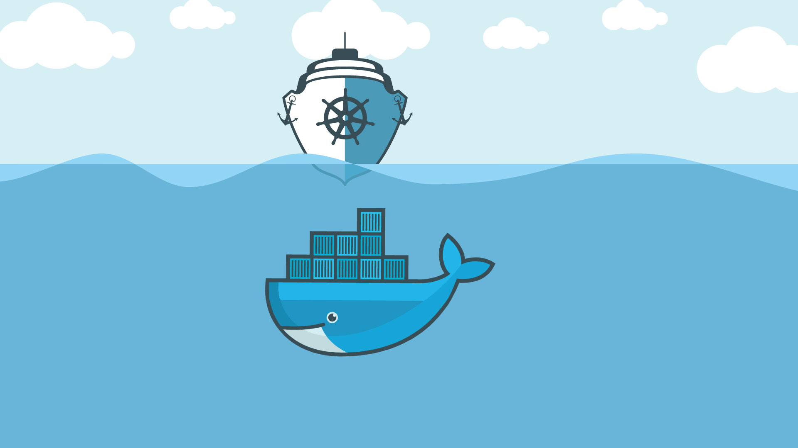
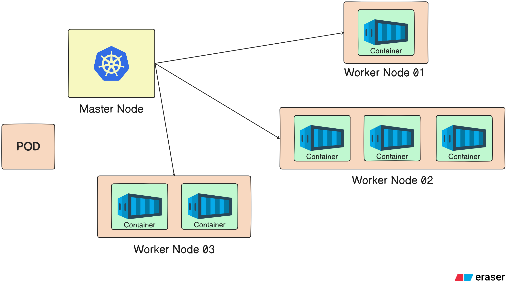
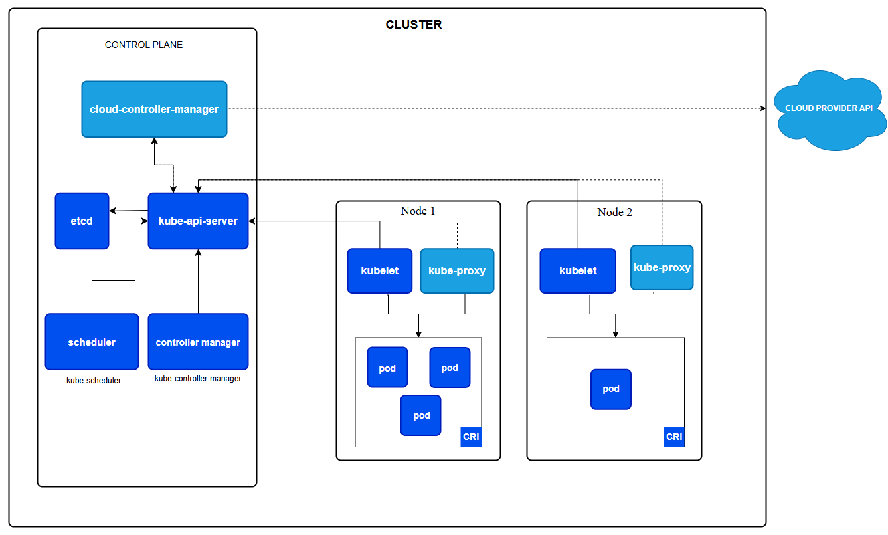
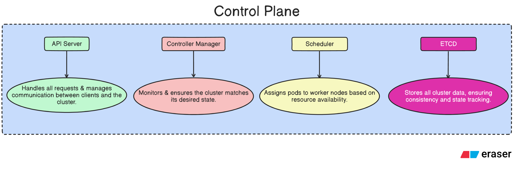
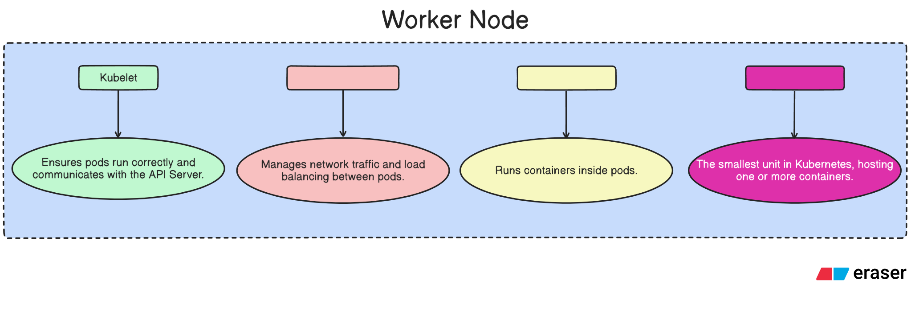

<!-- @format -->

# Understanding Kubernetes (K8S) Cluster Management

    

## What is Kubernetes (K8S)?

**Kubernetes** is an **open-source platform** designed to automate the **deployment**, **scaling** & **management of containerized applications**. It **orchestrates containers**, ensuring that they are **deployed consistently, scaled based on demand** & **maintained with minimal downtime**. Kubernetes handles the **complexities of container management**, such as **load balancing**, **self-healing** & **rolling updates** while allowing developers and operators to focus on delivering high-performance applications in a reliable and scalable manner.

This open-source project is hosted by the **Cloud Native Computing Foundation (CNCF)**.

The term **K8S** is a shorthand for Kubernetes, where the **"8"** represents the **8 letters** between the "K" & the "s" in the word Kubernetes.

## Understanding Kubernetes and Docker

To effectively understand Kubernetes (K8s), it's **important** to have a **foundational understanding** of **Docker**. In Docker, applications are deployed within **containers** which package everything the application needs to run. **Kubernetes**, on the other hand, **manages these containers at a much larger scale** often **handling thousands of containers** depending on the application's traffic & needs.

## Visualizing Docker and Kubernetes

- **Docker:** Think of Docker as a **Ship** carrying multiple containers. Each container holds a piece of the application.

- **Kubernetes:** Now, **envision that same ship but with a steering wheel**. Just as the captain uses the ship’s wheel to **navigate and direct the ship**, **Kubernetes serves as the "steering wheel"** for managing and orchestrating containers. It **automates container deployment**, **scaling** & **management across clusters**, ensuring everything runs smoothly and efficiently.

    

## What are Monolithic Architecture and Microservices Architecture?

### Monolithic Architecture

In **Monolithic Architecture**, imagine a restaurant with a single large kitchen where everything is handled from taking orders, preparing food to serving customers.

- **Key Challenge:** If there’s an issue with one part of the kitchen it can affect the entire restaurant’s operations.

- Similarly, in monolithic applications, all components of the system (UI, business logic, database) are **tightly integrated**. If a **problem arises in one part of the system** it can cause issues across the entire application.

### Microservices Architecture

Microservices Architecture, on the other hand, is more like a food delivery service (e.g., FoodPanda or Pathao) that works with a network of different restaurants, each specializing in a particular type of food (e.g., one restaurant for burgers, another for rolls).

- **Key Advantage:** When we place an order it's not prepared in one large kitchen but rather in specialized kitchens (microservices) that handle specific tasks. Each restaurant (microservice) is responsible for preparing a specific portion of the order.

- **Resilience:** If one restaurant faces an issue it does not necessarily affect the others. For example, if the burger place has a delay the rolls restaurant can still fulfill orders without disruption.

## Why Do We Need Kubernetes?

While Docker made deploying applications in containers much easier due to their lightweight nature **managing large numbers of containers in production environments quickly became a challenge**. As containerized applications scaled, organizations faced significant issues such as **container failures**, which could lead to operational disruptions and business losses.

**Kubernetes was introduced to solve these problems by automating and streamlining several critical tasks in container management**. Some key features Kubernetes provides include:

- **Autoscaling:** **Automatically adjusts the number of containers based on traffic patterns**, ensuring optimal resource usage during peak and off-peak hours.

- **Load Balancing:** Distributes network traffic across multiple containers to ensure no single container is overwhelmed.

- **Automated Deployment:** Deploys containers across available nodes in a cluster ensuring efficient resource utilization & high availability.

- **Self-Healing:** Automatically replaces failed containers, ensuring minimal downtime and improved system resilience.

## Kubernetes Origins and Open Source

Kubernetes was initially **created by Google in 2013, using the Go (Golang)** programming language. Initially, it was a proprietary tool but in **2014, Google made Kubernetes open-source** and **donated it to the Cloud Native Computing Foundation (CNCF)**. This move helped Kubernetes gain broad adoption and support within the open-source community.

## Languages Supported by Kubernetes

Kubernetes primarily supports **`YAML`** and **`JSON`** for defining configurations allowing flexibility in managing cluster deployments and configurations.

## Alternatives of Kubernetes

- Docker Swarm
- Apache Mesos
- Openshift
- Nomad, etc

## Difference between Docker Swarm and Kubernetes

    
| **Category** | **Docker Swarm** | **Kubernetes** |
| :--- | :--- | :--- |
| **Install & Configurations** | Quite Easy and Fast | Complicated and Time Consuming |
| **Supports** | Only work with Docker Containers | Can work with any other containers such as Docker, ContainerD, etc. |
| **Data Volumes** | Can be shared with any other Containers | Can be shared to the same pod's containers |
| **GUI** | Not Supported | Supported |
| **Autoscaling** | Not Supported | Supported |

## Master Node and Worker Node

- **Master Node:** This is the **control center of the Kubernetes cluster**. It **manages** the **entire cluster**, **making decisions about the cluster’s state** such as **scheduling** containers and **monitoring** their health. It also handles the **API server**, **etcd - KV STOre** (for storing data) & **controller manager**.

- **Worker Node:** These are the **nodes that actually run the applications**. Each worker node **hosts a set of containers (pods)** and communicates with the master node to receive instructions. They handle the actual execution of the tasks that the master node schedules.

In short:

- Master Node: Manages the cluster and controls the workflow.
- Worker Node: Executes the tasks (runs containers) as directed by the master node.

    

## Kubernetes Architecture

The Kubernetes architecture consists of two main components: Control Plane and Worker Node. These components work together to manage and orchestrate containers in a cluster.

    

Here’s a simple breakdown:

### **1. Control Plane (Master Node)**

The **Control Plane is the brain of the Kubernetes cluster**, responsible for making decisions about the cluster such as **scheduling workloads** and **maintaining the desired state of the system**. Key components of the Control Plane are given below :

#### **1. API Server**

Once **`kubectl`** (**Kubernetes command-line tool**) is installed on the master node, **developers can run commands to interact with the Kubernetes cluster**. For example, when a developer issues a command to create a pod, here's how it works:

1. **Command Submission:** The developer runs a command using **`kubectl`** to create a pod.

2. **API Server:** The **command is sent to the API Server**. The **API Server acts as the entry point for all commands and requests** made to the Kubernetes cluster.

3. **Forwarding the Request:** The API Server then processes the request and forwards it to the appropriate component like the **Scheduler** or **Controller Manager** to carry out the task. For example, **it will direct the request for pod creation to the right component that handles pod management**.

4. **Execution:** After processing, the necessary components like the **Scheduler will ensure that** the **task like pod creation is carried out on the worker nodes**.

In other words, the **API Server is like the Gatekeeper** that receives and processes all requests in the Kubernetes system, ensuring that tasks are executed in an organized and efficient manner.

#### **2. Controller Manager**

The **Controller Manager** is like the **"Decision Maker"** in the Kubernetes cluster. Here's how it works:

- **Collecting Information:** It regularly **collects data from the API Server which includes information about the desired state of the cluster**. For example, how many pods should be running or if any pods have failed.

- **Making Decisions:** Based on this data, the **Controller Manager evaluates the Cluster's State and decides what actions need to be taken to match the desired state**. For example, if a pod goes down the controller manager might decide to create a new pod to replace it.

- **Sending Instructions:** After making decisions, **the Controller Manager sends the necessary instructions back to the API Server** which then executes those actions like starting a new pod, scaling up a deployment, etc.

In summary, the **Controller Manager ensures that the Kubernetes cluster is always in the desired state** by making the **right decisions** and **instructing the API Server** on what needs to happen.

#### **3. Scheduler**

The **Scheduler is responsible for deciding where and how to run the containers (pods) in the Kubernetes cluster**. Here's how it works:

- **Receiving Instructions:** After the **API Server collects the necessary data from the Controller Manager it notifies the Scheduler about tasks that need to be performed**. For example, this could involve increasing the number of pods for a service.

- **Making Placement Decisions:** Upon receiving the instructions, the **Scheduler looks at the available Worker Nodes in the cluster** to **decide where to place the new pod(s)**. It considers factors like available resources (CPU, memory), node health & any other constraints.

- **Taking Action:** After making the placement decision the **Scheduler ensures that the appropriate pod(s) are assigned to the correct node** where they can be created and run.

In short, the **Scheduler ensures that workloads (pods) are placed on the right worker nodes** **based on resource availability and the cluster's needs**.

#### **4. Etcd - KV Store**

**Etcd** is like a **database for Kubernetes** but it doesn’t store regular data it stores the cluster’s state. This includes vital information about the entire cluster, such as:

- Pod IP addresses
- Node details (Master node and Worker nodes)
- Networking configurations
- Secrets and configurations

**Etcd stores all of this data in a Key-Value pair format** meaning each piece of **data is stored as a unique key** & its corresponding value. In simple terms, **etcd** acts as the **"Source of Truth"** for the entire Kubernetes cluster. It ensures that all components in the cluster **are in sync with the latest configurations and data**.

Here is a **Diagram summarizing the Control Plane** :

    

### **2. Worker Node**

The **Worker Node is responsible for running the application containers** & **executing tasks as instructed by the Master Node**. It **communicates with the Master Node** to receive instructions on resource allocation and workload management. **To ensure scalability a Kubernetes cluster can have multiple Worker Nodes**.

The minimum number of worker nodes in a Kubernetes cluster depends on your needs, but the general recommendation is:

- **At least 2 Worker Nodes:** This ensures high availability and fault tolerance. If one node fails the other can continue running the workloads.

- **For Production:** Ideally 3 or more worker nodes are recommended. This provides better resilience and allows for load balancing, failover & easy scaling.

Key components of the Worker Node are given below :

#### **1.Kubelet**

The **Kubelet is the primary component of the Worker Node** in Kubernetes. It is **responsible for managing the pods running on the Working Node**. Key responsibilities of the Kubelet:

- **Pod Monitoring:** It continuously checks if the pods are running as expected.

- **Self-Healing:** If a pod fails or becomes unhealthy the **Kubelet ensures a new pod is created to replace the failed one.** Since a **failed pod cannot be restarted the new pod might have a different IP address**.

- **Communication with API Server:** **The Kubelet gets details and instructions about the pods from the API Server on the Master Node**.

In essence, the Kubelet ensures that pods are always running and healthy on the worker node and helps maintain the desired state of the cluster.

#### **2.Kube-Proxy**

The **Kube-proxy is a key component of the Worker Node that manages networking in the Kubernetes cluster**. It **handles network communication between pods and services**. Key responsibilities of Kube-proxy:

- **Networking Configuration:** It **maintains the network configuration for the cluster**, including pod IPs & ensures that traffic can reach the right destinations.

- **Load Balancing:** It performs load balancing to distribute traffic across multiple instances of a service ensuring efficient resource usage & high availability.

- **Routing:** **Kube-proxy routes the traffic to the appropriate pod** based on the service's configuration.

- **Communication with API Server:** Kube-proxy retrieves pod and service information from the API Server on the Master Node.

In short, **Kube-proxy ensures that the network is properly configured** traffic is routed efficiently & **load balancing is applied across pods within the Kubernetes cluster**.

#### **3.Pods**

A **Pod is the smallest and simplest unit in Kubernetes**. It can **contain one or more containers** & it’s **where applications are deployed**. Key features of a Pod:

- **Containers:** A Pod **typically hosts a single container** but multiple containers can be grouped together in the same Pod if they need to share resources or communicate closely.

- **IP Address:** **Each Pod gets a unique IP address** (either public or private) within the cluster & this IP is shared by all containers within that Pod.

- **Best Practice:** It’s **generally recommended to have one container per Pod for simplicity**, scalability & isolation. However, multiple containers can be used when necessary, as long as they need to work closely together.

In short, **Pods are where your application containers run in Kubernetes** and they manage networking and resource sharing for the containers within them.

#### **4.Container Engine**

**A Container Engine provides the runtime environment needed to create and manage containers**. In Kubernetes, the Container Engine interacts directly with the container runtime, which is **responsible for running and managing the containers inside Pods**. Key points:

- **Container Engine:** It handles the operations of creating, running, and managing containers.

- **Container Runtime:** The container runtime is what actually runs the container. It is responsible for pulling images, creating containers, and executing them.

- **Popular Container Engines:** Some well-known container engines are:

  - **Docker:** One of the most widely used and trusted container engines.

  - **CRI-O:** A lightweight container engine that adheres to Kubernetes' Container Runtime Interface (CRI).

  - **containerd:** An industry-standard core container runtime used in Docker and other container platforms.

  - **rkt (Rocket):** Another container engine, though less commonly used in Kubernetes.

For **simplicity and compatibility with Kubernetes, Docker is often the go-to container engine** & we'll use it in our setup when working with Kubernetes clusters.

Here is a **Diagram summarizing the Worker Node** :

    

